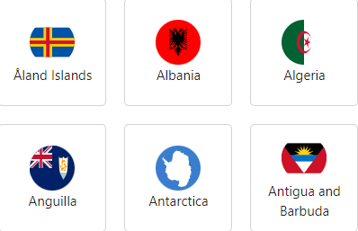
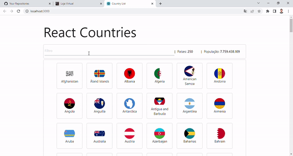

<h1 align="center">
    
</h1>

## 💻 Apresentação

## 🚀 Tecnologias

Esse projeto foi desenvolvido com as seguintes tecnologias:

- [React]
- [React Hooks]
- [Styled-components]
- [Rest Countries API]

## 💻 Sobre o Projeto

A country list é um campo de filtro que consegue listar países em tempo real consumindo uma API e dizer a quantidade populacional tão como a quantidade de países baseados em filtro pesquisado.

## Ícones

- 📦 Nova funcionalidade;
- 🆙 Atualização;
- 🐞 Correção de bug;
- 🏁 Release.
